# Style Hub 🛍️

A premium Flutter e-commerce application designed for a seamless shopping experience. Style Hub offers a wide range of accessories with a modern, user-friendly interface.

## 🌟 Features

-   **User Authentication**: Secure Login, Register, Forgot Password, and Google Sign-In integration.
-   **Product Discovery**: Browse categories, view offers, and search for products with detailed filters.
-   **Shopping Experience**: 
    -   Detailed product views with image galleries.
    -   Add to cart functionality.
    -   Apply coupons and manage cart items.
-   **Checkout & Orders**: complete checkout process, address management, and order history.
-   **Localization**: Support for English and Arabic languages (`flutter_localization`).
-   **State Management**: Built with **Bloc/Cubit** for robust and testable state management.
-   **Dependency Injection**: Uses `get_it` for clean service location.
-   **Local Storage**: `Hive` and `SharedPreferences` for caching and persistent data.
-   **Responsive Design**: `flutter_screenutil` ensures the app looks great on different screen sizes.

## 📱 Screenshots

<div align="center">
  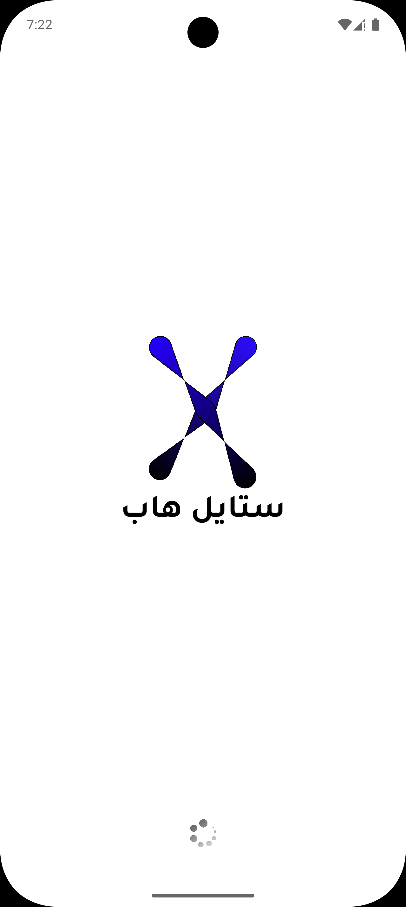
  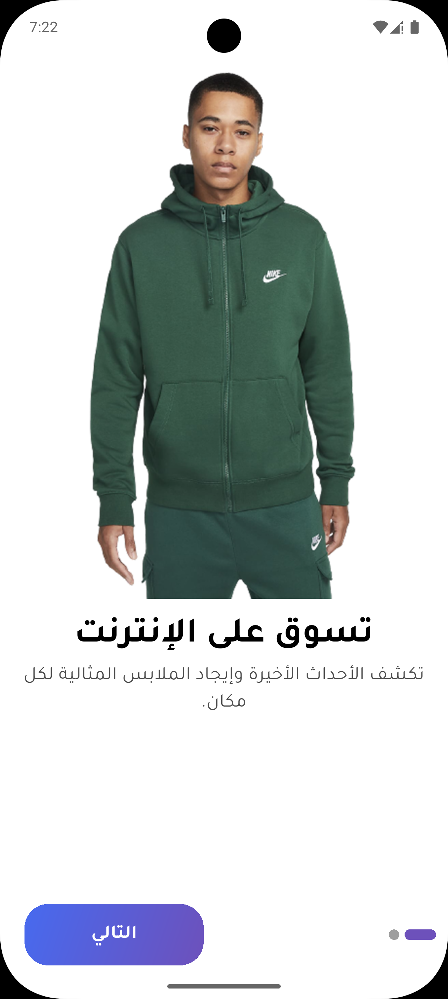
  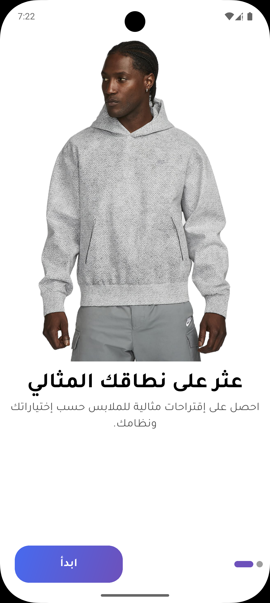
  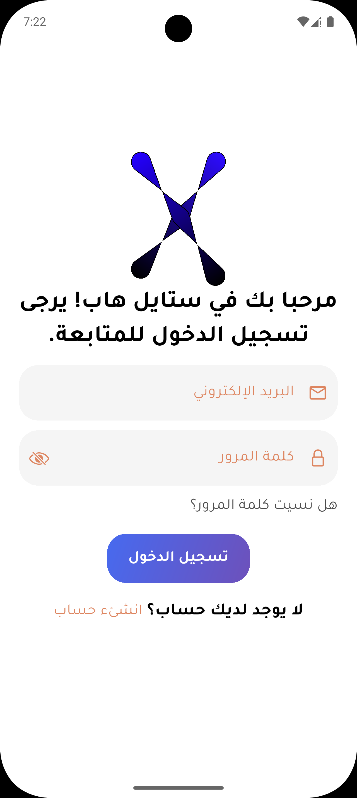
  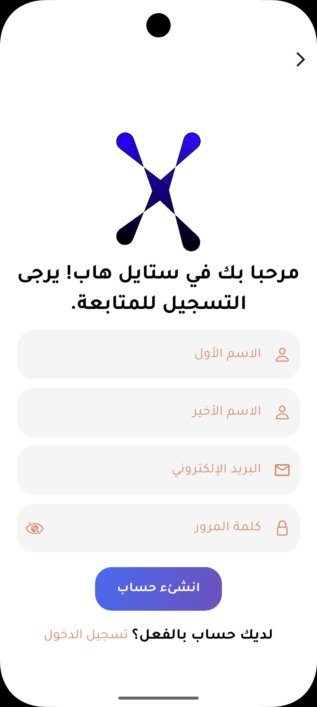
  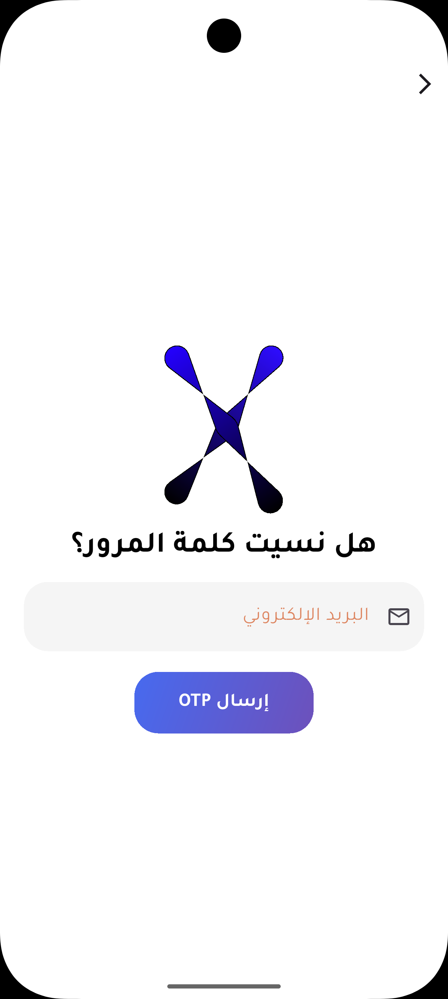
  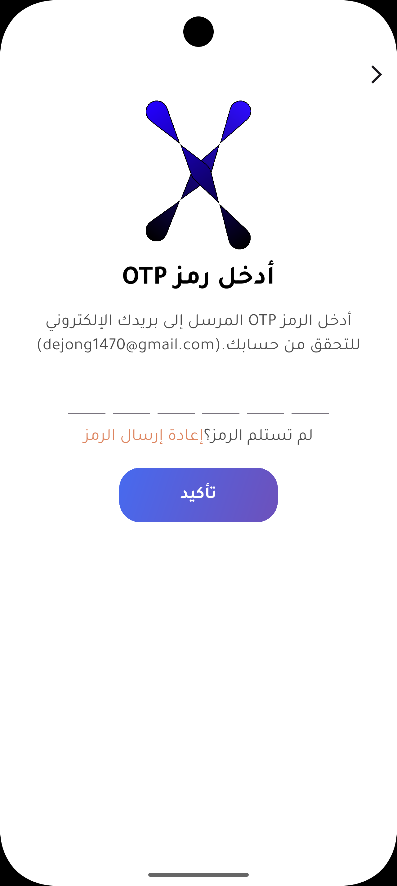
  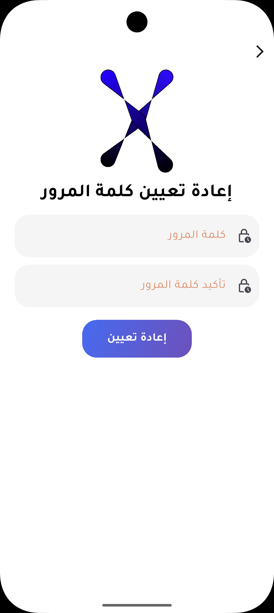
  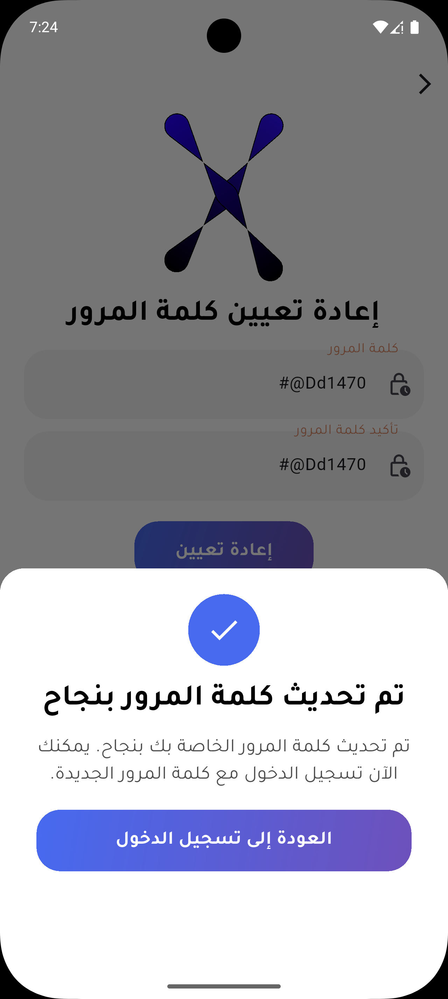
  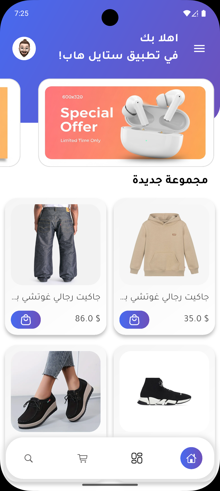
  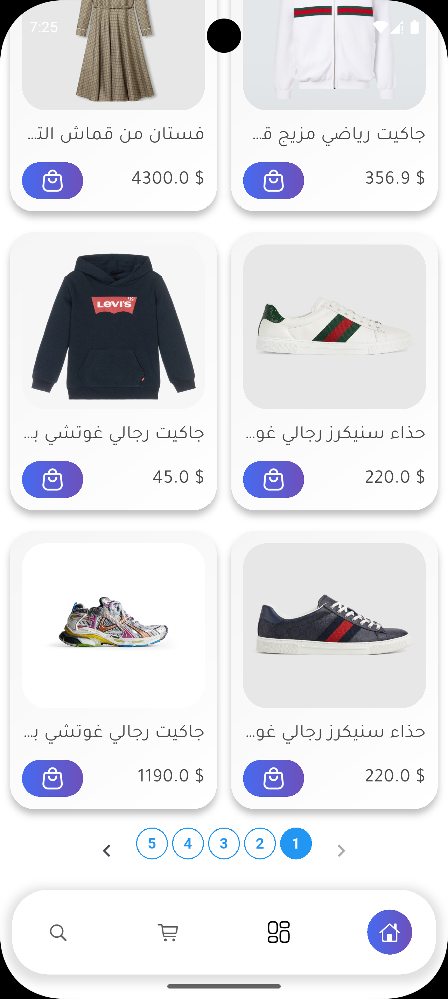
  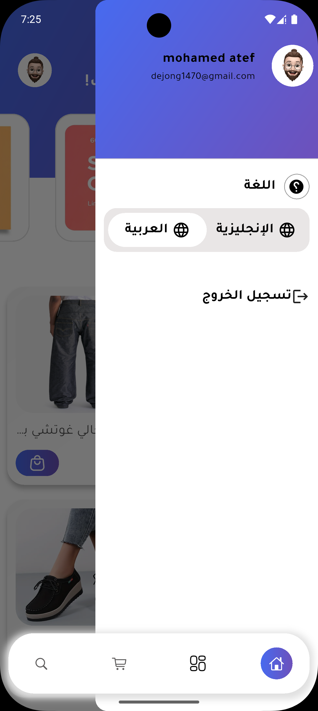
  
  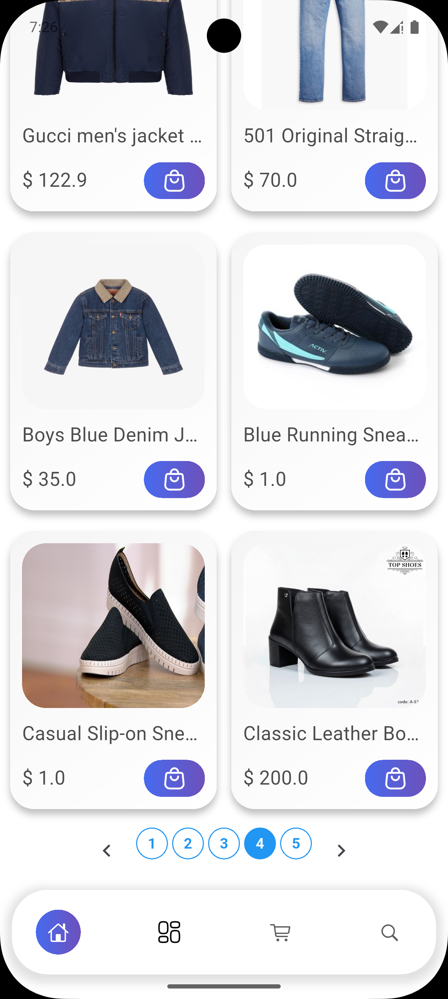
  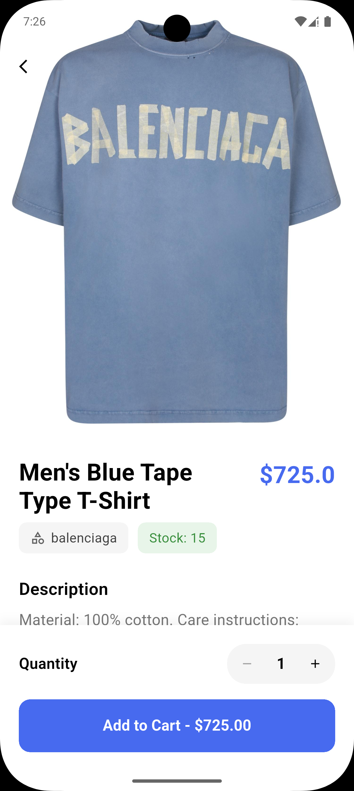
  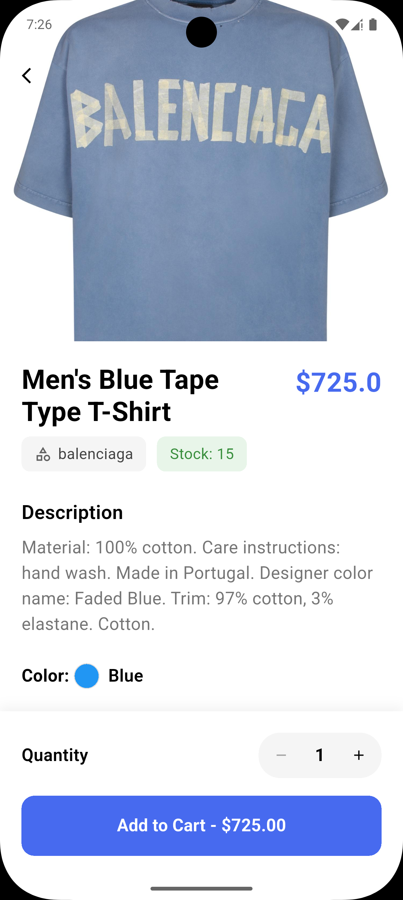
  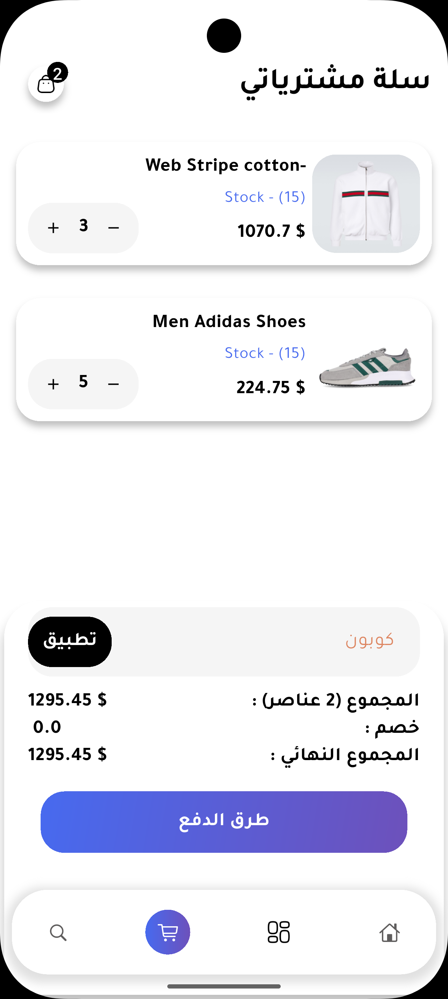
  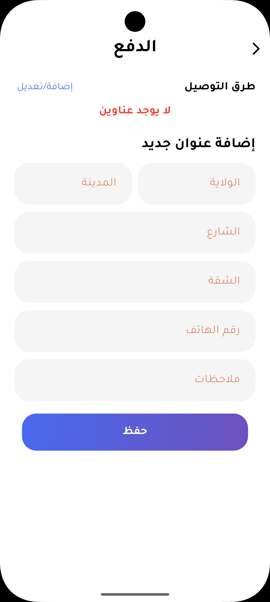
  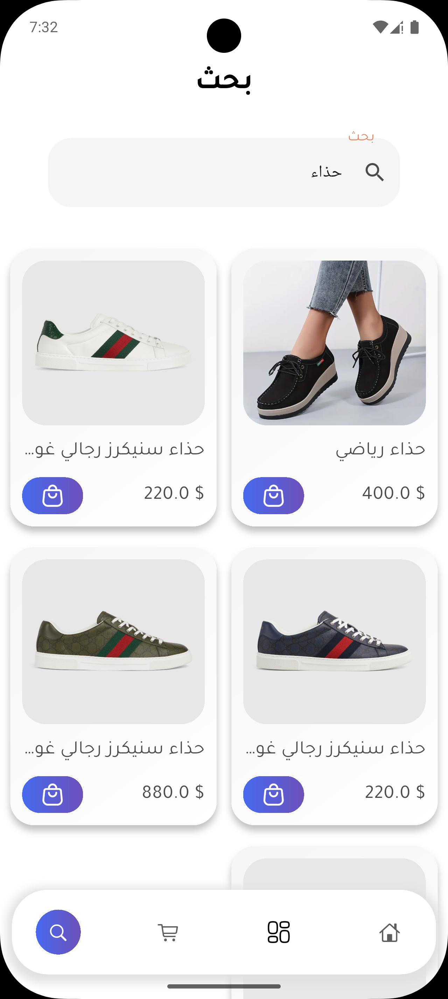
  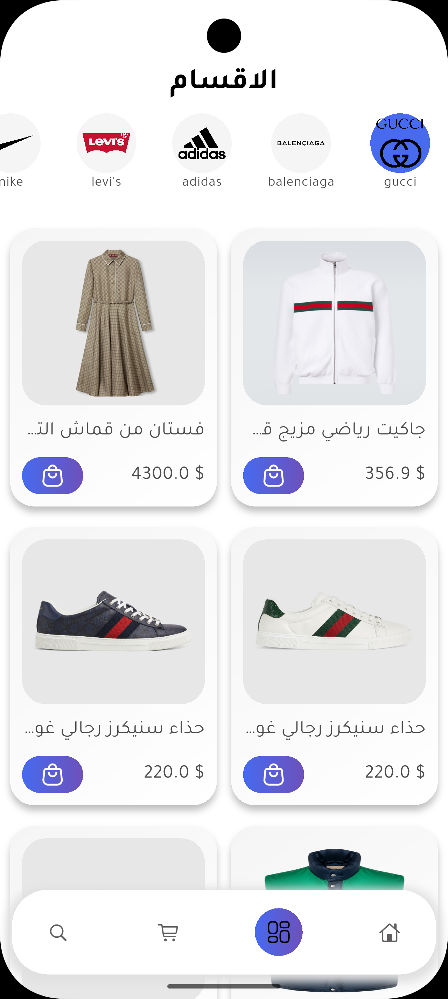
  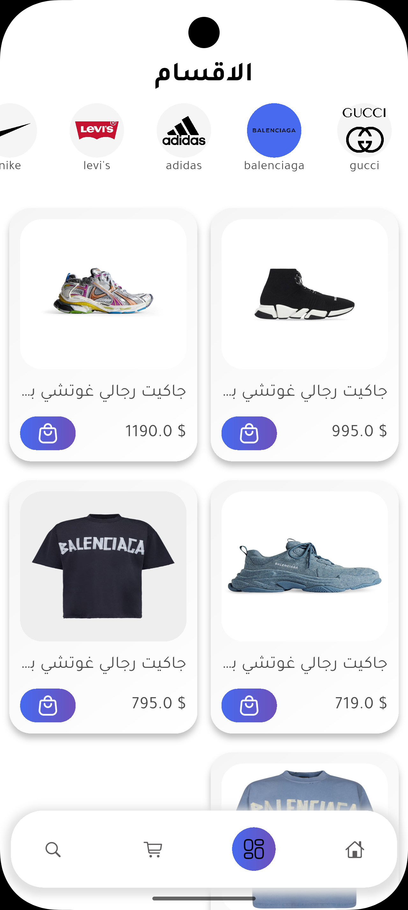
  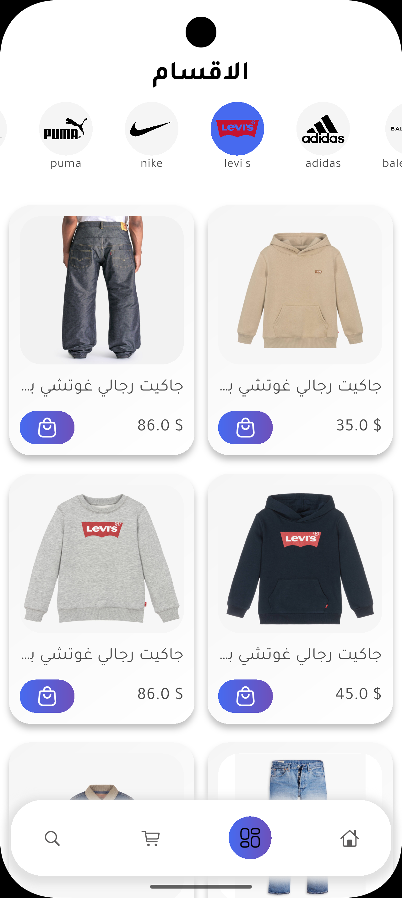
</div>

## 🛠️ Technology Stack

-   **Framework**: Flutter & Dart
-   **State Management**: `flutter_bloc`
-   **Routing**: `go_router`
-   **Networking**: `dio`, `pretty_dio_logger`
-   **Dependency Injection**: `get_it`
-   **Local Storage**: `hive`, `shared_preferences`, `flutter_secure_storage`
-   **UI/UX**: `flutter_screenutil`, `skeletonizer`, `awesome_snackbar_content`, `google_nav_bar`, `smooth_page_indicator`
-   **Environment Management**: `flutter_dotenv`

## 🚀 Getting Started

### Prerequisites

-   Flutter SDK
-   Dart SDK

### Installation

1.  **Clone the repository**:
    ```bash
    git clone https://github.com/mohamedatef04/style_hub.git
    cd style_hub
    ```

2.  **Install dependencies**:
    ```bash
    flutter pub get
    ```

3.  **Run the app**:
    ```bash
    flutter run
    ```

## 📄 License

This project is licensed under the MIT License.
